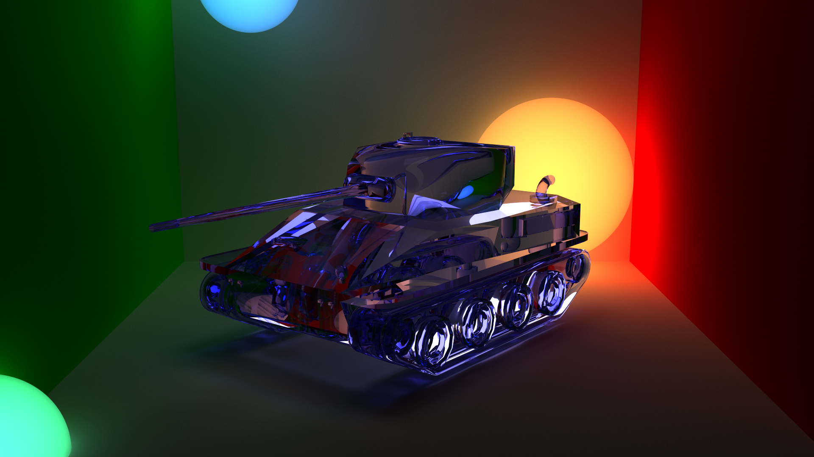
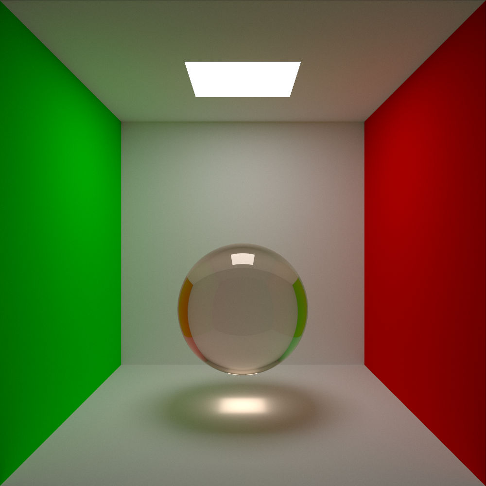

# Armasa Path Tracer

An OpenGL-based path tracer inspired by [Zeta Path Tracer](https://github.com/Magorx/zeta_path_tracer)

## How to use

You will need `glew` and `cmake` installed to
start the tracer.

Clone the repository and navigate to `main.cpp`.
Then uncomment any example you want to see

**Be careful**: complex scenes may hang up your videocard,
so you will have to reboot your computer, or wait for
OpenGL to raise a timeout error and crash the program.

You may need to adjust the scene to render it in
smaller portions. To do that, increase the parameter
passed to `set_dynamic_frame_substeps` and
`set_static_frame_substeps` methods, which are present in
each example. By default, all examples are set up to run
smoothly on AMD Radeon Pro 5500M.

**For MacOS users**: As OpenGL has been deprecated on MacOS,
funny things can happen to your system, including total crash
with screen filled with pink noise. Be sure to save everything
you're editing before running this program.

## Examples:

- Full-HD 9.500 triangle tank mesh render

- A glass sphere in a cornell box

- A "Stanford Dragon"

See `/showcase` directory for more high-resolution examples